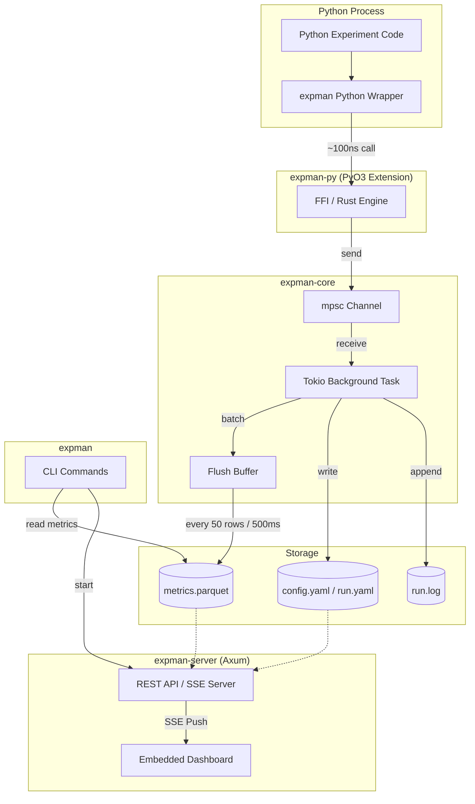

# expman-rs

[](https://opensource.org/licenses/MIT)
[](https://lokeshmohanty.github.io/expman-rs)

High-performance experiment manager written in Rust, with a Python wrapper for non-blocking logging, a live web dashboard, and a friendly CLI.

## Features

- **Non-blocking Python logging**: `log_metrics()` is a ~100ns channel send — never blocks your training loop
- **Live dashboard**: SSE-powered real-time metric streaming, run comparison charts, artifact browser
- **Scalar metric filtering**: Toggle which metric columns appear in the runs table with one click
- **Single binary**: CLI + web server in one `expman` binary — no Python runtime needed for the server
- **Efficient storage**: Batched Arrow/Parquet writes, not per-step read-concat-write
- **Nix dev environment**: Reproducible with `nix develop`

## Installation

### For CLI & Dashboard (Rust)
Install the `expman` command-line tool via cargo:
```bash
cargo install expman
```

### For Python Logging (PyPI)
Install the `expman-rs` library via pip:
```bash
pip install expman-rs
```
This includes the `expman` CLI as well.

### Alternatively: Download or Install from GitHub
- **Direct Download**: Download the pre-built `expman` binary or Python wheels from [GitHub Releases](https://github.com/lokeshmohanty/expman-rs/releases).
- **Python (pip)**:
  ```bash
  pip install git+https://github.com/lokeshmohanty/expman-rs.git
  ```
- **Rust (cargo)**:
  ```bash
  cargo install --git https://github.com/lokeshmohanty/expman-rs.git expman
  ```

## Quick Start

### Python Logging

**Option A: Global Singleton (Easiest)**
```python
import expman

expman.init("resnet_cifar10")
expman.log_params({"lr": 0.001})
expman.log_metrics({"loss": 0.5}, step=0)
# Auto-closes on script exit
```

**Option B: Context Manager (Recommended for scope control)**
```python
from expman import Experiment

with Experiment("resnet_cifar10") as exp:
    exp.log_metrics({"loss": 0.5}, step=0)
```

### Dashboard

```bash
expman serve ./experiments
# Open http://localhost:8000
```

### CLI

```bash
expman list ./experiments              # list all experiments
expman list ./experiments -e resnet    # list runs for an experiment
expman inspect ./experiments/resnet/runs/20240101_120000
expman clean resnet --keep 5 --force   # delete old runs
expman export ./experiments/resnet/runs/20240101_120000 --format csv
```

## Development (Nix)

```bash
nix develop                    # enter dev shell
just test                      # run all tests
just dev-py                    # build Python extension (uv pip install -e .)
just serve ./experiments       # start dashboard
just watch                     # watch mode for tests
just build-docs                # build and open documentation
```

### Dashboard Features
- **Live Metrics**: Real-time SSE streaming of experiment metrics and logs.
- **Scalar Filter**: Toggle individual metric columns in the Runs table via chip buttons — no page reload.
- **Deep Inspection**: View detailed run configurations, metadata, and artifacts.
- **Artifact Browser**: Preview `parquet`, `csv`, and other files directly in the browser.
- **Comparison View**: Overlay multiple runs on a shared timeline for analysis.
- **Server-side filtering**: Pass `?metrics=loss,acc` to `/api/experiments/:exp/runs` to limit which scalars are returned.

## Examples

Practical code samples are provided in the [examples/](examples/) directory:

- **Python**: [examples/python/basic_training.py](examples/python/basic_training.py)
- **Rust**: [examples/rust/logging.rs](examples/rust/logging.rs)

To run the Python examples, ensure you have built the extension first with `just dev-py`.
To run the Rust example, use:
```bash
cargo run --example logging -p expman
```

## For Rust

To use `expman-rs` in your own project:

1. **Install Rust**: Use [rustup](https://rustup.rs/)
2. **Setup Just**: We use `just` for task management. Install it with `cargo install just`.
3. **Project Structure**:
   - `crates/expman-core`: The main library.
   - `crates/expman-cli`: The terminal tool and dashboard server.
4. **Using the library**:
   Add this to your `Cargo.toml`:
   ```toml
   [dependencies]
   expman = "0.1"
   ```
   Basic usage:
   ```rust
   use expman::{ExperimentConfig, LoggingEngine, RunStatus};

   fn main() -> anyhow::Result<()> {
       let config = ExperimentConfig::new("my_rust_exp", "./experiments");
       let engine = LoggingEngine::new(config)?;

       engine.log_metrics([("loss".to_string(), 0.5.into())].into(), Some(0));

       engine.close(RunStatus::Finished);
       Ok(())
   }
   ```

## Architecture



## Storage Layout

```
experiments/
  my_experiment/
    experiment.yaml          # display name, description
    20240101_120000/         # run directory
      metrics.parquet      # all logged metrics (Arrow/Parquet)
      config.yaml          # logged params/hyperparameters
      run.yaml             # run metadata (status, duration, timestamps)
      run.log              # text log
      artifacts/           # user-saved files
```
