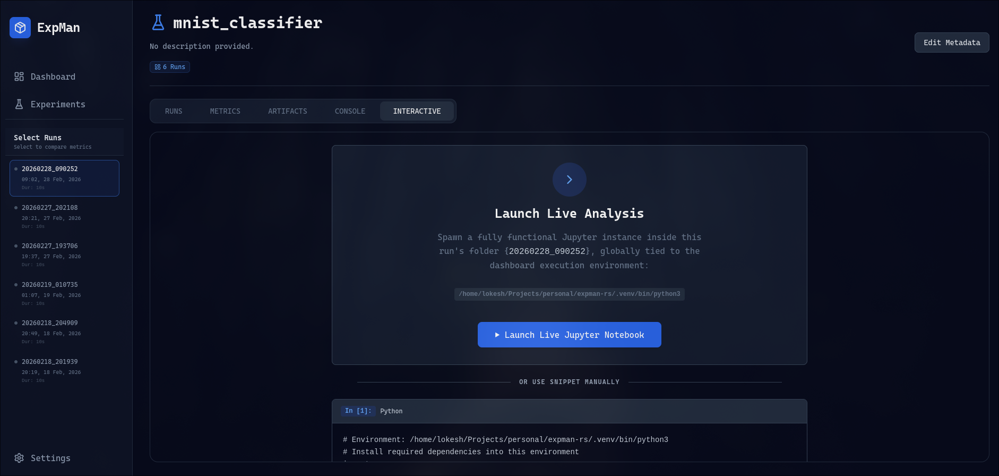
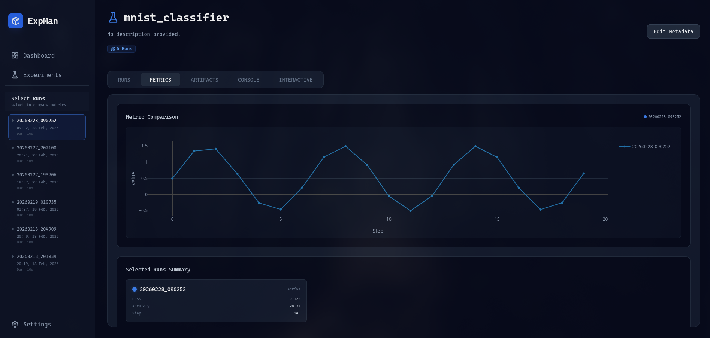
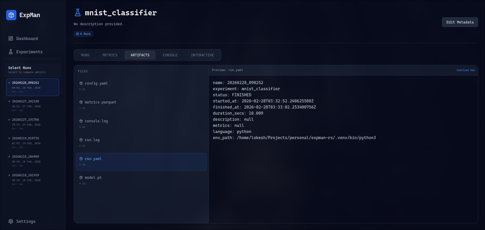
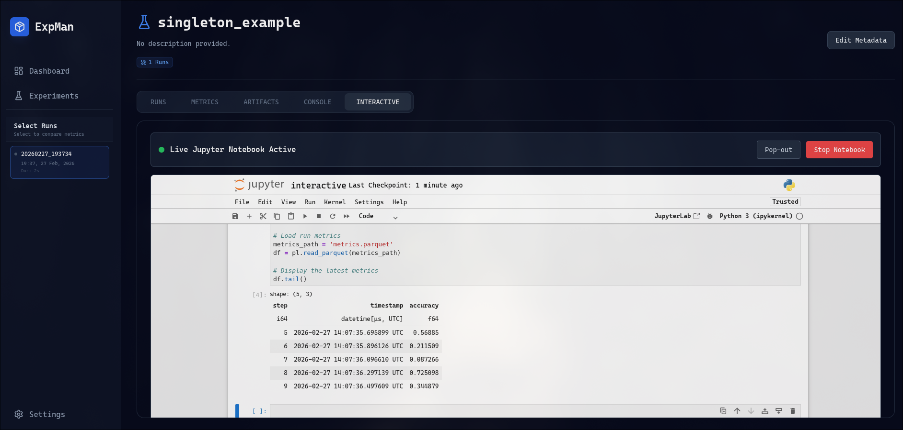

# Experiment Manager built using Rust

[](https://crates.io/crates/expman)
[](https://pypi.org/project/expman-rs/)
[](https://github.com/lokeshmohanty/expman-rs)
[](https://opensource.org/licenses/MIT)
[](https://lokeshmohanty.github.io/expman-rs)

High-performance experiment manager written in Rust, with a Python wrapper for non-blocking logging, a live web dashboard, and a friendly CLI.

## Features

- **Non-blocking Python logging**: `log_vector()` is a ~100ns channel send — never blocks your training loop
- **Live dashboard**: SSE-powered real-time metric streaming, run comparison charts, artifact browser
- **Scalar metric filtering**: Toggle which metric columns appear in the runs table with one click
- **Single binary**: CLI + web server in one `exp` binary — no Python runtime needed for the server
- **Efficient storage**: Batched Arrow/Parquet writes, not per-step read-concat-write
- **Nix dev environment**: Reproducible with `nix develop`

## Screenshots

<p align="center">
  
  
</p>
<p align="center">
  
  
</p>

## Installation

### From Cargo

```bash
cargo install expman-cli
```

### From PYPI

```bash
pip install expman-rs
```

### Alternatively: Download or Install from GitHub

- **Direct Download**: Download the pre-built `exp` binary or Python wheels from [GitHub Releases](https://github.com/lokeshmohanty/expman-rs/releases).
- **Python (pip)**:

  ```bash
  pip install git+https://github.com/lokeshmohanty/expman-rs.git
  ```
- **Rust (cargo)**:

  ```bash
  cargo install --git https://github.com/lokeshmohanty/expman-rs.git expman-cli
  ```

## Quick Start

### Python

**Option A: Global Singleton (Easiest)**
```python
import expman as exp

exp.init("resnet_cifar10")
exp.log_params({"lr": 0.001})
exp.log_vector({"loss": 0.5}, step=0)
# Auto-closes on script exit
```

**Option B: Context Manager (Recommended for scope control)**
```python
from expman import Experiment

with Experiment("resnet_cifar10") as exp:
    exp.log_vector({"loss": 0.5}, step=0)
```

## For Rust

Basic usage:

```rust
use expman::{ExperimentConfig, LoggingEngine, RunStatus};

fn main() -> anyhow::Result<()> {
   let config = ExperimentConfig::new("my_rust_exp", "./experiments");
   let engine = LoggingEngine::new(config)?;

   engine.log_vector([("loss".to_string(), 0.5.into())].into(), Some(0));

   engine.close(RunStatus::Finished);
   Ok(())
}
   ```

### Dashboard

```bash
exp serve ./experiments
# Open http://localhost:8000
```

### CLI

```bash
exp list ./experiments              # list all experiments
exp list ./experiments -e resnet    # list runs for an experiment
exp inspect ./experiments/resnet/runs/20240101_120000
exp clean resnet --keep 5 --force   # delete old runs
exp export ./experiments/resnet/runs/20240101_120000 --format csv
```

## Development

Please see [CONTRIBUTING.md](CONTRIBUTING.md) for detailed instructions on setting up your local environment, building the Python bindings, and important git configuration notes.

```bash
nix develop                    # enter dev shell
just test                      # run all tests
just dev-py                    # build Python extension (uv pip install -e .)
just serve ./experiments       # start dashboard
just watch                     # watch mode for tests
just build-docs                # build and open documentation
```

## Documentation

For detailed usage, refer to the standalone documentation files for each component:
- [`expman-cli`](crates/expman-cli/README.md) - Command-line interface definitions and references.
- [`expman`](crates/expman/README.md) - Core high-performance async Rust logging engine.
- [`expman-py`](crates/expman-py/README.md) - Python extension for non-blocking logging.
- [`expman-server`](crates/expman-server/README.md) - Axum web server and SSE live streaming API.


### Dashboard Features
- **Live Metrics**: Real-time SSE streaming of experiment metrics and logs.
- **Live Jupyter Notebooks**: Instantly spawn a live Jupyter instance natively bound to any run's execution environment directly from the UI, with auto-generated analytics boilerplate (Polars).
- **Scalar Filter**: Toggle individual metric columns in the Runs table via chip buttons — no page reload.
- **Deep Inspection**: View detailed run configurations, metadata, and artifacts.
- **Artifact Browser**: Preview `parquet`, `csv`, and other files directly in the browser.
- **Comparison View**: Overlay multiple runs on a shared timeline for analysis.
- **Server-side filtering**: Pass `?metrics=loss,acc` to `/api/experiments/:exp/runs` to limit which scalars are returned.

## Examples

Practical code samples are provided in the [examples/](examples/) directory. The Python example demonstrates logging metrics, alongside generating and storing rich media artifacts (audio, video, plots) directly natively.

- **Python**: [examples/python/basic_training.py](examples/python/basic_training.py)
- **Rust**: [examples/rust/logging.rs](examples/rust/logging.rs)

To run the Python examples, ensure you have built the extension first with `just dev-py` and installed the dev dependencies (`uv pip install -e ".[dev]"`).

To run the Rust example, use:

```bash
cargo run --example logging -p expman
```

## Experiments Layout

```
experiments/
  my_experiment/
    experiment.yaml          # display name, description
    20240101_120000/         # run directory
      metrics.parquet      # all logged metrics (Arrow/Parquet)
      config.yaml          # logged params/hyperparameters
      run.yaml             # run metadata (status, duration, timestamps)
      run.log              # text log
      artifacts/           # user-saved files
```
